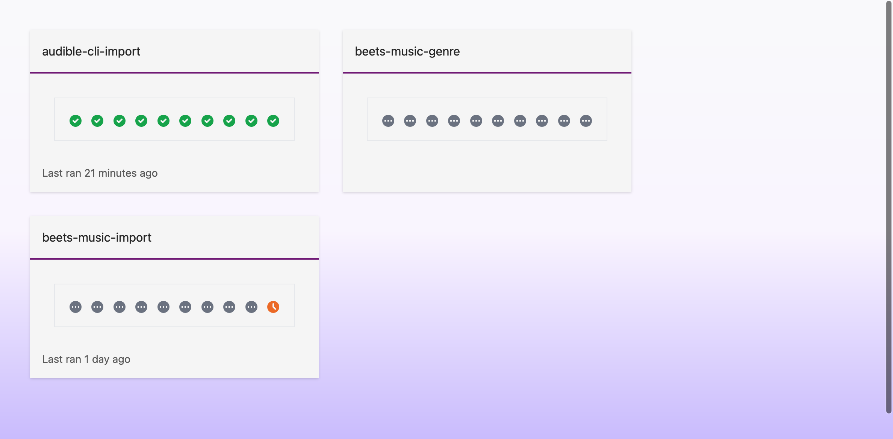
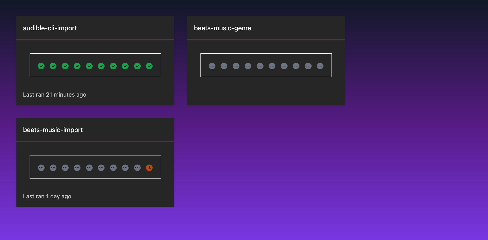

# CronJob status dashboard

A little dashboard for your cronjobs




## Running

We provide a Dockerfile intended to be used in a Kubernetes cluster with a service account with permissions to list jobs and cronjobs.

### Environment Variables

- `K8S_NAMESPACE` _defaults to default_ The namespace to list the cronjobs from within
- `LOAD_FROM` _defaults to default_ One of: 'cluster', 'default' Cluster will use a mounted service account

## Developing

### Tests

Tests are written with jest

```
npm run test
```

There are also lints to run

```
npm run lint
npm run lint -- --fix # To fix things
```

Formatting is done with prettier

```
npx prettier --write .
```

### Server

First, run the development server:

```bash
npm run dev
# or
yarn dev
```

Open [http://localhost:3000](http://localhost:3000) with your browser to see the result.
